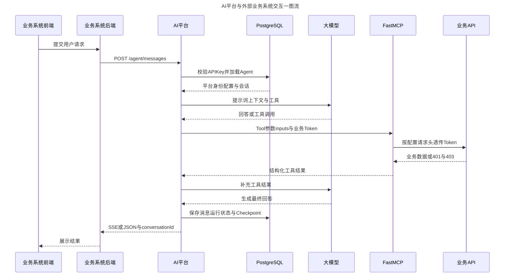

# AI 平台与外部业务系统交互说明

## 1. 文档目的

本文说明当前 AI-backend 如何接入外部 Java、Go、Python 或其他业务系统，重点回答以下问题：

- 外部业务系统如何获得并调用一个 Agent。
- AI 平台如何识别业务平台和业务用户。
- 多轮会话如何隔离和恢复。
- Agent 如何调用由业务 HTTP API 转换而来的 MCP Tool。
- 业务用户 Token 如何被原样透传给目标业务 API。
- 哪些数据会持久化，哪些敏感数据只在本次运行中存在。
- 当前版本的安全边界和后续需要补强的能力。

当前方案定位为公司内网阶段：AI 平台负责平台身份识别、Agent 编排、会话隔离和工具执行；目标业务 API 继续负责业务用户的角色与权限校验。

## 2. 一句话理解

```text
业务系统后端使用 X-API-Key 调用 AI Agent，使用 external_user_id 标识业务用户；
Agent 需要访问业务 API 时，FastMCP 把 X-Business-Authorization 按 Tool 配置的请求头名称原样转发，
最终是否允许操作仍由目标业务系统决定。
```

正式接入时，业务系统前端或移动端不应直接持有平台 API Key。推荐始终由业务系统后端调用 AI-backend。

## 3. 一图看懂完整交互

动漫风格总览图：


可编辑版本：

[在 FigJam 查看“AI平台与外部业务系统交互一图流”](https://www.figma.com/board/RH8TUmk0nElDoEAhP4bbIy?utm_source=other&utm_content=edit_in_figjam&oai_id=v1%2Fo9HsKbJE0qWqMzEiktcqo9fw2LL0UiapjJHEZnDcIgbpE8MiCY2klm&request_id=e5b54beb-37f6-4a55-8ca5-1c2abd060cba)



图中展示的是一次可能触发 MCP Tool 的完整正常路径。Agent 如果无需调用业务 API，会在第一次模型调用后直接生成回答并返回。

## 4. 交互参与方与职责

| 参与方 | 当前职责 |
| --- | --- |
| 业务系统前端 | 收集用户输入、展示 SSE 或 JSON 结果；不保存 AI 平台 API Key |
| 业务系统后端 | 安全保存平台 API Key，提供稳定的 `external_user_id`，按需传入当前用户业务 Token |
| AI 管理平台 | 创建业务平台、签发 API Key、配置 Agent、MCP Tool、模型和知识库 |
| AI-backend | 校验平台身份、检查 Agent 绑定、组装 Agent、管理会话和运行记录 |
| Agent 内部 MCP 适配层 | 发现已发布 Tool，将 FastMCP Tool 转换为 LangChain Agent 可调用工具 |
| FastMCP 模块 | 根据数据库配置把 Tool 参数转换为普通 HTTP 请求并调用目标业务 API |
| 目标业务 API | 校验业务 Token、执行最终业务权限判断、返回业务数据或错误 |
| PostgreSQL | 保存平台、Agent、Tool、会话、消息、运行记录和 Checkpoint |
| Milvus | 保存和检索知识库向量，不参与业务平台 API Key 鉴权 |
| 大模型服务 | 根据提示词、上下文和工具描述生成回答或工具调用决策 |

## 5. 管理配置阶段

外部业务系统正式调用前，需要在 AI 管理平台完成三部分配置。

### 5.1 创建业务平台并签发 API Key

在“业务平台”页面创建平台，例如：

```json
{
  "platform_code": "order_system",
  "platform_name": "订单业务系统",
  "description": "订单域 AI Agent 接入",
  "status": "enabled"
}
```

然后为该平台签发 API Key。外部请求使用：

```http
X-API-Key: aik_xxxxxxxxxxxxxxxxx
```

API Key 只代表“请求来自哪个业务平台”，不代表具体业务用户，也不替代业务用户 Token。

### 5.2 把业务 HTTP API 配置为 MCP Tool

在“工具管理”页面配置：

- Tool 名称和说明。
- 目标 API URL 和 HTTP 方法。
- 固定请求头。
- path、query、header、body 参数。
- 参数来源：`tool`、`runtime`、`static`。
- 可选的 `business_token_header`。
- 超时时间、输出 Schema 和绑定业务平台。

三种参数来源的含义：

| 来源 | 值从哪里来 | 适用场景 |
| --- | --- | --- |
| `tool` | 大模型生成的 Tool 参数 | 查询关键字、页码、业务对象 ID |
| `runtime` | `/agent/messages` 的 `inputs`，支持点分路径 | 租户编码、组织 ID、当前业务上下文 |
| `static` | 管理端预先配置的固定值 | 固定版本、固定开关、固定请求体字段 |

配置完成后先测试目标 API，再发布 Tool。未发布或已停用的 Tool 不会被 Agent 正常装配。

### 5.3 配置 Agent

创建或编辑 Agent 时配置：

- Agent ID、名称和系统提示词。
- 使用的 Chat 模型和运行参数。
- 绑定的一个或多个业务平台。
- 挂载的 MCP Tool。
- Plan、A2A、知识库、结构化用户表单等内部能力开关。
- Agent 固定挂载的一个或多个知识库；业务调用方不需要知道或传入知识库 ID。
- 可选的上下文总结参数。

保存 Agent 时，平台会校验所选 Tool 的业务平台绑定是否覆盖 Agent 的平台范围，并校验挂载的知识库全部存在且处于启用状态。运行时主要读取已经保存的 Agent 配置，不再接受业务调用方临时指定知识库。

## 6. 运行调用阶段

### 6.1 业务系统发起请求

业务系统后端调用：

```http
POST /agent/messages
Content-Type: application/json
X-API-Key: aik_xxxxxxxxxxxxxxxxx
X-Business-Authorization: Bearer eyJhbGciOi...
```

其中 `X-Business-Authorization` 是可选请求头。只有 Agent 可能调用需要业务用户身份的 API 时才需要传入。

请求体示例：

```json
{
  "agent_id": "order-agent",
  "external_user_id": "user_10086",
  "conversation_id": null,
  "message": "查询我最近三笔订单",
  "message_type": "text",
  "stream": true,
  "additional_system_context": "当前业务场景为售后工单，订单号为 SO20260914001。",
  "inputs": {
    "tenant_code": "tenant_001"
  },
  "file_ids": []
}
```

`additional_system_context` 是可选的本次调用系统级补充上下文。后端会把它作为独立段落追加到 Agent 模板系统提示词末尾，不会把它写成用户消息。该字段最多 20000 字符，只应由可信业务后端生成，不应直接放入未经处理的终端用户输入。

该字段默认只对当前一次普通调用生效；如果后续对话仍然依赖相同背景，业务方需要在每次请求中继续传入。Agent 因用户表单等原因中断后恢复时，后端会沿用原运行保存的补充上下文，不需要在恢复请求中再次覆盖。

关键身份字段：

| 字段 | 来源 | 作用 |
| --- | --- | --- |
| `X-API-Key` | AI 管理平台签发 | 解析出可信 `platform_id` |
| `external_user_id` | 业务系统后端 | 标识当前业务平台中的稳定用户 |
| `conversation_id` | AI-backend 首次生成 | 普通 Agent 用于标识多轮会话；一次性 Agent 不生成该字段 |
| `X-Business-Authorization` | 当前业务用户登录态 | 只供本次 MCP Tool 调用目标 API 时透传 |

### 6.2 AI 平台校验身份和 Agent

AI-backend 使用独立短事务完成以下操作：

1. 对 `X-API-Key` 做 Hash 比对。
2. 校验 Key、业务平台状态和有效期。
3. 得到可信的 `platform_id`；请求体不能自行指定平台 ID。
4. 校验目标 Agent 是否绑定当前业务平台。
5. 读取 Agent 配置，创建或恢复会话和运行记录。
6. 关闭数据库 Session，再进入 LLM、MCP 和 SSE 长耗时阶段。

会话隔离主键可以理解为：

```text
platform_id + external_user_id + conversation_id
```

Agent 维度也会保存到会话记录中，业务方查询聊天列表时可以使用 `agent_id` 过滤。

### 6.3 Agent 组装与模型调用

Agent 按模板装配：

- 系统提示词和模型。
- 已配置的 MCP Tool。
- Plan、A2A、知识库和附件读取等内部能力。
- 当前会话 Checkpoint 和历史上下文。
- 本次 `inputs`、`file_ids`，以及 Agent 模板固定挂载的知识库白名单。

模型可以直接回答，也可以选择调用一个 MCP Tool。

### 6.4 MCP Tool 调用目标业务 API

FastMCP 工具生成与权限融合总览：


当模型调用 Tool 时，链路为：

```text
LangChain Agent
  → Agent MCP Adapter
  → FastMCP Streamable HTTP Endpoint
  → HTTPAPIToolExecutor
  → 目标业务 API
```

Agent MCP Adapter 会在 AI 平台内部附加：

```text
X-Agent-Runtime-Inputs
X-Agent-Runtime-Credentials
X-Agent-Run-Id
```

这些是 AI 平台内部协议头，外部业务调用方不需要也不应该自行构造。

`inputs` 和运行时凭证会进行 Base64 URL-safe 编码，以便放入内部 HTTP 请求头。Base64 只是编码而不是加密，因此 MCP Endpoint 应保持为 AI 平台内部入口，不应作为公网接口暴露。

FastMCP 执行器根据 Tool 配置完成：

1. 合并模型 Tool 参数、Runtime inputs 和固定参数。
2. 构造 path、query、header 和 JSON body。
3. 读取本次运行的 `business_token`。
4. 按 `business_token_header` 指定的名称写入目标请求头。
5. 调用目标业务 API 并解析 JSON 或文本响应。

例如外部调用传入：

```http
X-Business-Authorization: Bearer current-user-token
```

Tool 配置为：

```json
{
  "business_token_header": "X-Token"
}
```

FastMCP 最终调用业务 API 时发送：

```http
X-Token: Bearer current-user-token
```

AI 平台不会自动增加、删除或替换 `Bearer ` 前缀。

### 6.5 权限结果处理

目标业务 API 仍是最终权限裁决方：

| 目标 API 结果 | AI 平台处理 |
| --- | --- |
| `2xx` | 把结构化结果返回给 Agent，模型继续生成最终回答 |
| `401` | 转换为“业务用户凭证无效或已过期” |
| `403` | 转换为“当前业务用户没有执行该操作的权限” |
| 其他非 `2xx` | 截取有限长度的错误信息返回给 Agent |
| 网络错误或超时 | Tool 调用失败，Agent 得到受控错误结果 |

AI 平台当前不重复维护业务用户的角色、菜单和操作权限。

### 6.6 保存与返回

运行结束后 AI-backend 使用新的短事务保存：

- 用户消息和 Agent 最终回答。
- 面向用户的完整运行时间线，包括思考过程、工具调用与结果、任务计划、A2A 子 Agent 事件、上下文总结状态和运行错误。
- Agent 生成的结构化表单、中断状态，以及用户提交、拒绝或取消表单的结构化结果。
- 会话摘要字段。
- 运行状态、耗时和错误信息。
- LangGraph Checkpoint。
- A2A 主子运行关系和工具调用元数据。

完整运行时间线以版本化结构保存到 `agent_messages.structured_content`。业务系统重新进入历史会话后，可以根据该字段按原始事件顺序还原工具卡片、任务计划、表单和最终 Markdown 内容。连续模型文本和思考增量会在入库前合并，避免逐 Token 事件造成记录无意义膨胀。

`agent_messages` 与 LangGraph Checkpoint 的用途不同：前者是可长期查询和展示的业务会话记录，后者是 Agent 多轮运行及中断恢复使用的执行状态，不能用 Checkpoint 代替历史消息接口。

以下敏感数据不应持久化到会话、Checkpoint、运行记录或普通日志：

- 完整平台 API Key。
- `X-Business-Authorization` 的完整值。
- FastMCP 内部运行时凭证头。

返回方式：

- `stream=false`：返回统一 JSON。
- `stream=true`：返回 SSE。只展示普通回答时至少处理 `run_start`、`model_delta`、`run_end` 和 `error`；需要完整交互界面时还应处理 `reasoning_delta`、`tool_call`、`tool_result`、`task_plan`、`interrupt` 和 `sub_agent_event`。

普通会话 Agent 首次调用需要从响应中取得并保存 `conversation_id`，后续同一会话继续传入该值。

如果 Agent 模板开启了“一次性对话”，每次调用都是独立任务：后端会忽略请求中的
`conversation_id`，响应返回 `conversation_id=null`，不创建会话和消息历史，也不会
出现在会话列表中；`agent_runs`、Token、工具调用、耗时和错误信息仍会正常记录。

### 6.7 结构化表单与中断恢复

Agent 启用表单能力后，可以调用内置表单工具生成字段定义并触发中断。业务前端收到 `interrupt.data.payload.type=user_form` 后，根据 `payload.data` 渲染表单。

用户操作完成后仍调用统一入口 `POST /agent/messages`，继续使用原 `conversation_id`，并提交：

```json
{
  "agent_id": "order-agent",
  "external_user_id": "user_10086",
  "conversation_id": "conv_xxx",
  "message": "已提交表单：订单确认",
  "message_type": "form_submit",
  "stream": true,
  "payload": {
    "type": "user_form",
    "data": {
      "form_id": "form_xxx",
      "action": "accept",
      "values": {
        "order_id": "ORDER-1001",
        "confirmed": true
      }
    }
  },
  "file_ids": []
}
```

AI-backend 会自动找到该会话中等待恢复的运行并继续执行。表单定义、用户操作和恢复后的运行时间线都会写入会话历史。

如果表单包含文件字段，应先通过 `/file/upload` 上传临时文件并设置 `is_long_term=false`，再同时把 `file_id` 放入表单 `values` 和请求顶层 `file_ids`。表单记录可以长期存在，但临时文件本体仍按临时文件清理策略过期。

## 7. 外部业务主要接口

### 7.1 Agent 对话

```text
POST /agent/messages
```

正式业务入口，需要 `X-API-Key`。可选携带 `X-Business-Authorization`。

### 7.2 查询用户会话列表

```text
POST /agent/conversations/search
```

```json
{
  "external_user_id": "user_10086",
  "agent_id": "order-agent",
  "page": 1,
  "page_size": 20
}
```

接口自动使用当前 `X-API-Key` 对应的 `platform_id`，只返回当前平台、当前用户下的会话。

### 7.3 查询会话详细消息

```text
POST /agent/conversations/messages
```

```json
{
  "external_user_id": "user_10086",
  "conversation_id": "conv_xxx",
  "limit": 100
}
```

### 7.4 查询运行记录

```text
POST /agent/runs/search
POST /agent/runs/detail
POST /agent/runs/chain
```

用于查询主 Agent、A2A 子 Agent、运行错误和耗时。

### 7.5 文件上传

```text
POST /file/upload
```

外部业务上传 Agent 临时附件时使用：

```http
X-API-Key: aik_xxxxxxxxxxxxxxxxx
Content-Type: multipart/form-data
```

```text
files=@requirement.pdf
is_long_term=false
external_user_id=user_10086
```

上传接口只保存文件并返回 `file_id`，不会直接触发 MinerU 或知识库入库。随后业务方
把 `file_id` 放入 `/agent/messages.file_ids`；Agent 读取附件或 FastMCP 转发
multipart 文件时，后端会再次校验该文件是否属于当前租户和当前用户。

multipart 表单必须传入：

```text
is_long_term=false  Agent 临时附件
is_long_term=true   知识库长期源文件
```

解析策略也由该字段统一决定：Agent 临时 PDF 使用本地 `pymupdf4llm` 轻量解析，不检查或调用 MinerU；只有知识库长期 PDF 才使用 MinerU 优先、`pymupdf4llm` 回退的解析链路。

`/file/*` 接口已经接入文件归属隔离。外部业务上传附件时必须同时携带
`X-API-Key` 和 `external_user_id`，服务端使用 API Key 解析可信 `platform_id`，并按
`platform_id + external_user_id` 保存和读取文件。外部业务不能读取、解析或删除其他
租户、其他用户的文件。

管理端知识库上传不携带 `X-API-Key` 和 `external_user_id`，文件保存为 `management`
归属；`is_long_term` 只控制文件生命周期，不参与租户身份判断。

知识库管理、Agent 模板管理、模型管理、业务平台管理和 MCP Tool 管理接口同样属于 AI 管理面，不是普通业务用户的公开调用接口。

### 7.6 AI 扩展能力与结构化识图

扩展能力中心向业务平台提供不依赖 Agent 会话的单次 AI 能力。第一项能力为结构化识图：

```text
POST /file/upload
  → files=@id-card-front.jpg、@id-card-back.jpg
  → is_long_term=false
  → external_user_id=user_10086
  → Header X-API-Key
  ← file_ids

POST /capabilities/vision/analyze
  → file_ids（按数组顺序联合分析，默认最多 8 张）
  → external_user_id
  → instruction
  → output_schema（可选；输出字段模板，不传时返回非结构化文本）
  → Header X-API-Key
  ← result（结构化对象或非结构化文本）、Token 用量和 request_id
```

AI 识图读取临时文件的原始图片，不调用 `/file/parse`，也不经过 MinerU。调用时会逐张校验
`file_ids` 是否属于当前 `platform_id + external_user_id`，不能使用其他租户或其他用户的文件。
全部图片会按照数组顺序放进同一次多模态模型请求，模型结合所有图片返回一份统一结果；任一图片
不符合归属、生命周期、格式或大小限制时，整次调用都会被拒绝。

结构化模式的 `output_schema` 是支持递归嵌套的字段模板：`""`、`0`、`0.1`、`false`
分别声明字符串、整数、小数和布尔字段；对象声明嵌套结构；只包含一个示例元素的数组声明数组元素结构。
基础字段识别不到时返回 `null`，对象仍保持模板结构，数组没有结果时返回空数组。模板默认最多嵌套
5 层、全部层级字段合计不超过 100 个；空对象、空数组、多个数组示例和 `null` 占位会被拒绝。

```json
{
  "Name": "",
  "Age": 0,
  "Address": {
    "Province": "",
    "City": ""
  },
  "Documents": [
    {
      "Type": "",
      "Number": "",
      "Valid": false
    }
  ]
}
```

识图属于无状态原子能力，不创建 Agent 会话、不使用 Checkpointer，也不写入
`agent.agent_runs`。平台通过 `capability.capability_runs` 单独记录业务平台、API Key、
模型、Token、耗时和执行状态。为了支持问题排查，运行记录还会保存 `instruction`、
`output_schema`、`file_ids`、附件名称与大小快照、最终识别结果以及失败诊断。
平台不会保存图片二进制、API Key 明文或业务 Token；运行列表只返回摘要，完整内容需通过
`POST /capabilities/management/runs/detail` 按 `request_id` 查询。

完整接口、数据表和管理页面方案见 `docs/AI扩展能力中心建设方案.md`。

## 8. 数据与安全边界

| 数据 | 是否持久化 | 当前边界 |
| --- | --- | --- |
| 平台 API Key | 明文和 Hash 均保存 | 当前为公司内网管理模式；鉴权使用 Hash 比对 |
| `platform_id` | 是 | 只能由有效 `X-API-Key` 解析，业务请求体不能指定 |
| `external_user_id` | 是 | 由业务后端提供，必须使用稳定且不可变的用户标识 |
| `conversation_id` | 是 | 由 AI 平台生成，用于多轮会话 |
| 用户消息与 Agent 回答 | 是 | 按平台、用户和会话隔离 |
| Agent 运行时间线与结构化表单 | 是 | 保存在消息 `structured_content` 中，供历史会话按事件顺序回放 |
| 表单上传的临时文件 | 限时保存 | 表单和 `file_id` 记录保留，文件本体按临时文件策略清理 |
| 业务用户 Token | 否 | 只存在于本次运行上下文，按 Tool 配置原样透传 |
| Runtime inputs | 运行中使用，部分运行元数据可能记录 | 不应放入密码、Token 等敏感值 |
| MCP Tool 固定请求头 | 是 | 不应直接保存用户级动态 Token |

建议的网络边界：

```text
互联网或业务终端
  → 业务系统前端
  → 业务系统后端
  → 公司内网 HTTPS 网关
  → AI-backend
```

不要让浏览器直接持有 `X-API-Key`，也不要把完整 API Key 和业务 Token 写入前端代码、URL、日志或 Git。

## 9. 当前责任划分

### AI 平台负责

- 识别调用来自哪个业务平台。
- 校验 Agent 是否允许当前平台使用。
- 隔离会话、消息和运行记录。
- 组装模型、内部工具、MCP Tool 和知识库能力。
- 把本次业务 Token 按 Tool 配置透传。
- 把业务 API 返回结果转换为 Agent 可理解的工具结果。
- 保存面向用户的完整运行时间线，并支持表单中断和恢复后的历史回放。

### 外部业务系统负责

- 认证自己的用户并维护登录态。
- 提供稳定的 `external_user_id`。
- 在服务端安全保存 AI 平台 API Key。
- 按需把当前用户 Token 放入 `X-Business-Authorization`。
- 对自己的 API 执行最终业务权限校验。
- 处理 SSE 断线、超时、重试和前端交互状态。
- 收到 `user_form` 中断时渲染受控表单，并通过统一 `/agent/messages` 入口提交结果。

## 10. 当前阶段限制

当前版本仍属于内网 MVP，主要限制包括：

- 管理平台尚未强制登录，必须依赖内网或网关访问控制。
- 文件和知识库管理接口尚未完成平台、用户级归属隔离。
- 平台 API Key 当前允许管理端查看完整明文。
- 尚未实现按平台的限流、调用配额、计费和审计策略。
- 尚未实现 OAuth2 换票、Token 刷新或密钥托管。
- 运行时主要依赖配置阶段保证 Agent 与 Tool 平台范围正确。
- 客户端主动断开 SSE 不应被当作可靠的 Agent 取消机制，正式取消能力需要独立的运行取消协议。

这些限制不改变当前核心协议：

```text
X-API-Key 识别业务平台
+ external_user_id 隔离业务用户
+ conversation_id 标识多轮会话
+ X-Business-Authorization 透传业务权限
```

## 11. 外部业务接入检查清单

- [ ] 已在 AI 管理平台创建并启用业务平台。
- [ ] 已签发有效 API Key，且只保存在业务系统后端。
- [ ] Agent 已绑定该业务平台。
- [ ] Agent 已挂载所需 MCP Tool。
- [ ] 如果 Agent 需要知识库能力，已在 Agent 模板中开启并挂载所需知识库。
- [ ] MCP Tool 已绑定正确平台并完成测试、发布。
- [ ] 需要用户权限的 Tool 已配置正确的 `business_token_header`。
- [ ] 业务后端始终提供稳定 `external_user_id`。
- [ ] 首次调用会保存 AI 平台返回的 `conversation_id`。
- [ ] 后续多轮调用复用相同平台、用户和会话 ID。
- [ ] SSE 客户端能够处理 `run_start`、`model_delta`、`run_end` 和 `error`。
- [ ] 如果启用完整过程展示，客户端能够处理工具、任务计划、A2A 和 `interrupt` 事件。
- [ ] 如果启用表单能力，客户端能够渲染 `user_form` 并使用原 `conversation_id` 提交结果。
- [ ] 历史详情使用 `/agent/conversations/messages` 返回的 `structured_content` 回放完整运行过程。
- [ ] 日志不会记录完整 API Key 和业务 Token。
- [ ] 同一会话不会无控制地并发提交多个请求。
- [ ] AI 管理接口和文件管理接口没有直接暴露到公网。

## 12. 相关文档

- `app/server/agent/docs/外部业务平台接入AI平台说明.md`
- `docs/MCP接入AI-backend方案.md`
- `docs/AI平台调用业务平台API权限校验方案.md`
- `app/server/agent/docs/业务平台接入与会话隔离改造方案.md`
